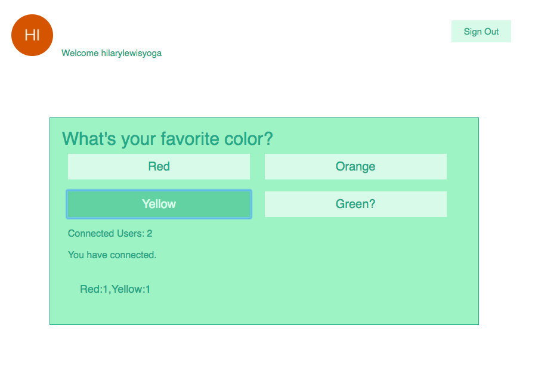

# Polling App

In this project, I used client-side security to build a real time application with WebSockets. When the server gets new information, it pushes it out to all of the connected clients. I used AuthO to authenticate users when a user wants to take a poll that is already create.

### On the Server
* Built a Node application that keeps all of the data in memory using local variables.
* Used WebSockets to broadcast poll results to the client.

### On the Client
* Used jQuery for all updating and DOM manipulations.
* Used WebSockets to broadcast your vote to the server.

